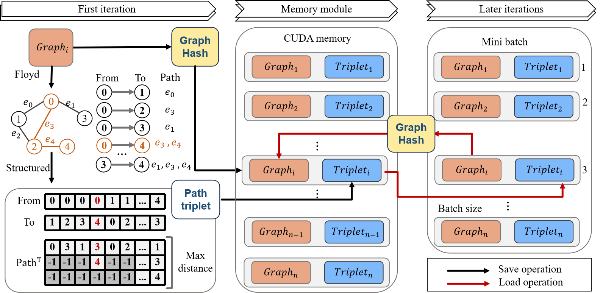

  

# Grammy
A Graphomer-based Multi-modal Modeling Strategy for Cancer Drug Response (CDR) Prediction

## Model Structure

## 🔧 Dependencies
The following packages are required to run Grammy:
Python >= 3.10
PyTorch >= 1.12.0
PyTorch Geometric (PyG) >= 2.0.0
RDKit >= 2022.03

## 🚀 Quick Start
python main.py

## contact me
shujialiu418@gmail.com